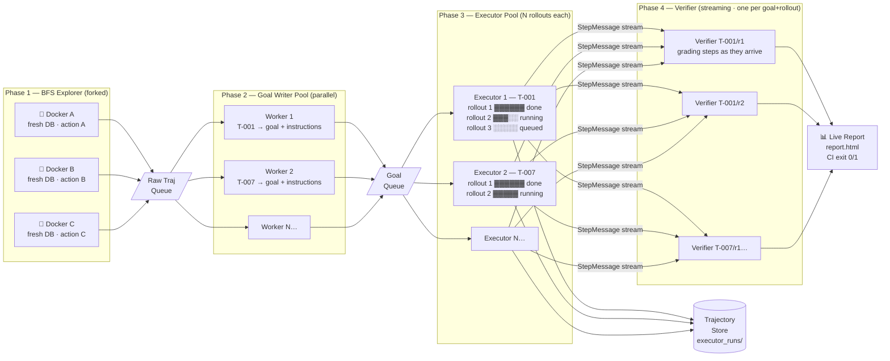

# Autonomous UI Test Harness

Black-box UI defect discovery for locally hosted web apps. The harness drives a real browser (Playwright), explores the app via BFS, converts discovered paths into plain-English test goals, executes them in parallel, and verifies each step with an LLM-based verifier to produce structured findings and an HTML report.

The target app is a buggy **Memos** instance shipped as a Docker image (`memos-buggy:latest`), but the architecture is app-agnostic: exploration, goal writing, execution, and verification are LLM-assisted with deterministic fallbacks (DOM heuristics, crash detection).

---

## How it works

```
Phase 1 — PLANNER
  One Docker instance → BFS exploration → state graph → trajectories.json
  + per-trajectory screenshots in screenshots/T-NNN/

Phase 2 — GOAL WRITER
  LLM converts each trajectory into plain-English goals → trajectories_goal.json

Phase 3 — EXECUTORS + VERIFIERS  (parallel)
  N Docker instances, one per goal → GoalExecutor runs each instruction
  VerifierAgent consumes step events → verifier_claims/T-NNN_<run_id>/claims.json

Phase 4 — REPORT
  Load verifier claims → render report.html → serve locally and open in browser
  (runs automatically after a full pipeline or --run-goals; also via --report)
```

**Key design note:** Executors are **goal-driven**, not raw trajectory replay. Each executor reads only `trajectories_goal.json` (plain-English instructions) and uses the LLM to resolve them to concrete UI actions at runtime. BFS trajectories inform goal writing via screenshots and step metadata, but are not replayed directly.

---

## Project structure

```
AutomaticUIFixingHarness/
├── run_harness.py              # Sole CLI entry point
├── pyproject.toml              # Python dependencies (uv/pip)
├── exploration_memory.md       # Live BFS exploration log (regenerated each run)
├── harness/
│   ├── browser/                # Playwright session wrapper
│   ├── docker/                 # Docker compose lifecycle
│   ├── planner/                # BFS, action ID, trajectory extraction, goal writer
│   ├── executor/                 # GoalExecutor + step queue messages
│   ├── verifier/                 # VerifierAgent (per-step bug detection)
│   ├── oracles/                  # LLM transport + LogicOracle (crash checks)
│   ├── reporter/                 # Load claims → render HTML → serve
│   ├── utils/                    # step_runner, fill_retry, elements, url helpers
│   ├── models/                   # Finding, PageState, Severity, etc.
│   └── tests/                    # pytest suite
└── output/                       # Default run artifacts (see Output artifacts)
```

---

## Setup

### Requirements

- **Python 3.13+**
- **Docker** (for app instances)
- **uv** (recommended package manager)

### 1. Load the Docker image (one-time)

```bash
docker load -i memos-buggy.image.tar.gz
```

### 2. Install Python dependencies

```bash
uv sync
uv run playwright install chromium
```

### 3. Configure the harness

All defaults live in **`.env.example`** (committed to the repo). Copy it to `.env` and fill in your values:

```bash
cp .env.example .env
# Edit .env — add your API key, tune depth, etc.
```

`.env` is gitignored so API keys stay local. Never commit real secrets.

**Minimum setup** — for a local LLM, set `LOCAL_LLM_URL` in `.env` (e.g. `http://localhost:8000`). For cloud LLMs, set one of:

```bash
ANTHROPIC_API_KEY=sk-ant-...
# or
OPENAI_API_KEY=sk-...
```

---

## Configuration

Configuration is loaded from **`.env`** at startup (via `harness/config.py`). Defaults are defined once in `harness/config.py` and mirrored in **`.env.example`**. CLI flags override specific values at runtime.

### Environment variables (`.env`)

| Variable | Default | Description |
|---|---|---|
| `DEPTH_N` | `3` | BFS exploration depth (max hops from root state) |
| `MAX_TRAJECTORIES` | `20` | Cap on goals executed in Phase 3 |
| `MAX_PARALLEL` | `4` | Max concurrent Docker + executor instances |
| `MAX_ACTIONS_PER_NODE` | `8` | Max workflows tried per BFS state |
| `OUTPUT_DIR` | `output` | Root output directory for all artifacts |
| `BFS_VERBOSE` | `0` | Set to `1` for step-level BFS debug logs |
| `LLM_PROVIDER` | _(auto)_ | Force provider: `anthropic` \| `openai` \| `local` |
| `ANTHROPIC_API_KEY` | _(empty)_ | Required when using Anthropic |
| `OPENAI_API_KEY` | _(empty)_ | Required when using OpenAI |
| `ANTHROPIC_MODEL` | `claude-sonnet-4-6` | Anthropic model |
| `OPENAI_MODEL` | `gpt-4o` | OpenAI model |
| `LOCAL_LLM_URL` | _(empty)_ | Local OpenAI-compatible endpoint (required when using `local`) |
| `LOCAL_LLM_MODEL` | `Qwen/Qwen3.5-9B` | Local model name |
| `DOCKER_IMAGE` | `memos-buggy:latest` | Docker image for the app under test |
| `CONTAINER_PORT` | `5230` | Port inside the container |
| `HEALTH_PATH` | `/healthz` | Health-check endpoint |
| `HEALTH_TIMEOUT` | `120` | Seconds to wait for container health |
| `BROWSER_HEADLESS` | `true` | Run Playwright headless |
| `BROWSER_VIEWPORT_WIDTH` | `1280` | Browser viewport width |
| `BROWSER_VIEWPORT_HEIGHT` | `800` | Browser viewport height |
| `REPORT_PORT` | `8765` | Preferred port for the HTML report server |

**LLM provider priority** (first match wins):

1. **Anthropic** — `LLM_PROVIDER=anthropic` or `ANTHROPIC_API_KEY` set
2. **OpenAI** — `LLM_PROVIDER=openai` or `OPENAI_API_KEY` set
3. **Local Qwen** — `LLM_PROVIDER=local` or fallback when no cloud API key is present

CLI flags `--depth`, `--max-trajectories`, and `--output` override `DEPTH_N`, `MAX_TRAJECTORIES`, and `OUTPUT_DIR` respectively.

### CLI flags

| Flag | Default | Description |
|---|---|---|
| `--planner-only` | off | Run Phases 1–2 only (BFS + goal writer); print trajectories and exit |
| `--skip-planner` | off | Skip Phase 1; load existing `trajectories.json` from output dir |
| `--goals-only` | off | Load `trajectories.json` → write `trajectories_goal.json` → exit |
| `--run-goals` | off | Load `trajectories_goal.json` → run executors + verifiers only |
| `--report` | off | Render + serve `report.html` only (skip all other phases) |
| `--no-llm` | off | Disable LLM oracle (deterministic BFS only; executors cannot resolve instructions) |
| `--verbose-bfs` | off | Step-level BFS logs (equivalent to `BFS_VERBOSE=1`) |
| `--depth N` | env / `3` | BFS depth override |
| `--max-trajectories N` | env / `20` | Executor cap override |
| `--rollout N` | off | Clear `executor_runs/` + `verifier_claims/`, then run N executor passes |
| `--output DIR` | env / `output` | Output directory override |

### Code-only settings (not in `.env`)

| Setting | Value | Location |
|---|---|---|
| Exploration memory file | `exploration_memory.md` (repo root) | `harness/planner/bfs_explorer.py` |
| Report port fallback | auto-increments from `REPORT_PORT` if busy | `harness/reporter/serve.py` |

---

## Running the harness

There is a single entry point:

```bash
uv run run_harness.py [options]
```

### Execution modes overview

| Mode | Command | Phases run | Requires |
|---|---|---|---|
| **Full pipeline** | `uv run run_harness.py` | 1 → 2 → 3 → 4 | Docker, Playwright, LLM (recommended) |
| **Planner only** | `--planner-only` | 1 → 2 | Docker, Playwright |
| **Skip planner** | `--skip-planner` | 2 → 3 → 4 | `trajectories.json` |
| **Goals only** | `--goals-only` | 2 | `trajectories.json` |
| **Run goals only** | `--run-goals` | 3 → 4 | `trajectories_goal.json` |
| **Report only** | `--report` | 4 | `verifier_claims/` |
| **Rollout** | `--rollout N` (with full or `--run-goals`) | 3 × N | Clears executor artifacts first |

The flags `--report`, `--goals-only`, and `--run-goals` are **standalone entry modes** — each short-circuits the normal pipeline. All other flags compose with the default flow.

---

### 1. Full pipeline (default)

Runs BFS exploration → goal writing → parallel executors + verifiers → HTML report.

```bash
# Local Qwen — no API key needed
uv run run_harness.py

# Anthropic (better quality)
ANTHROPIC_API_KEY=sk-ant-... uv run run_harness.py

# Tune depth, trajectory cap, and output location
uv run run_harness.py --depth 4 --max-trajectories 15 --output my-run/
```

When executors finish, Phase 4 runs automatically: `report.html` is written, a local server starts (default port 8765), and the report opens in your browser. The process blocks until you press Ctrl+C.

If no verifier claims were produced (e.g. zero trajectories), the report step is skipped.

---

### 2. Planner only (explore + write goals, no execution)

Runs Phase 1 (BFS) and Phase 2 (goal writer), prints discovered trajectories, then exits without running executors.

```bash
uv run run_harness.py --planner-only
```

Produces:
- `trajectories.json`
- `screenshots/T-NNN/` (per-step PNGs)
- `trajectories_goal.json`
- `exploration_memory.md`

Example terminal output:

```
============================================================
  BFS exploration complete — 7 trajectory/trajectories found
============================================================

  [01] T-001  (3 step(s))
       create_account → create_new_memo → create_memo_with_tag
         1. create_account  →  button[type="submit"]
         2. create_new_memo  →  textarea[placeholder="Any thoughts..."]
         3. create_memo_with_tag  →  button[aria-label="Save"]

  trajectories.json written to output dir
```

Tune exploration:

```bash
uv run run_harness.py --planner-only --depth 2 --output my-run/ --verbose-bfs
```

Deterministic exploration without LLM:

```bash
uv run run_harness.py --no-llm --planner-only
```

---

### 3. Skip planner (reuse existing trajectories)

Loads `trajectories.json` from the output dir, regenerates goals, then runs executors + verifiers.

```bash
uv run run_harness.py --skip-planner --output my-run/
```

Useful after `--planner-only` when you want to execute without re-exploring:

```bash
# Step 1: explore
uv run run_harness.py --planner-only --output my-run/

# Step 2: execute against saved trajectories
uv run run_harness.py --skip-planner --output my-run/
```

---

### 4. Goals only (regenerate goals from trajectories)

Reads existing `trajectories.json`, writes fresh `trajectories_goal.json`, and exits. Does not run BFS or executors.

```bash
uv run run_harness.py --goals-only --output my-run/
```

Use when you want to regenerate plain-English goals (e.g. after changing the LLM provider or model) without re-exploring.

---

### 5. Run goals only (execute existing goals)

Reads `trajectories_goal.json`, runs executors + verifiers, then opens the HTML report. Skips BFS and goal writing.

```bash
uv run run_harness.py --run-goals --output my-run/
```

Use when goals are already written and you only need to re-execute.

---

### 6. Rollout (repeat executor passes)

Clears prior `executor_runs/` and `verifier_claims/`, then runs the full executor + verifier pass N times. Each pass creates new run IDs and claims files.

With existing goals:

```bash
uv run run_harness.py --run-goals --rollout 3 --output my-run/
```

As part of the full pipeline:

```bash
uv run run_harness.py --rollout 2
```

Rollout results are summarized in `executor_trajectories.json` with a `rollout` index per entry.

---

### 7. HTML report only (standalone)

Re-render and view a report from existing verifier claims without re-running the harness. Useful when you already have `verifier_claims/` and only want to open the report again.

```bash
uv run run_harness.py --report --output my-run/
```

---

### 8. No-LLM mode

Disables the LLM oracle entirely. BFS falls back to DOM heuristics for action identification. Goal writing uses a heuristic fallback. Executors cannot resolve plain-English instructions without an LLM.

```bash
uv run run_harness.py --no-llm --planner-only   # exploration only
```

For meaningful executor runs, an LLM provider is required.

---

### Common multi-step workflows

**Explore → review → execute**

```bash
uv run run_harness.py --planner-only --output my-run/
# Review my-run/trajectories.json and screenshots/
uv run run_harness.py --skip-planner --output my-run/
# Report opens automatically when executors finish
```

**Explore → execute in one shot**

```bash
uv run run_harness.py --depth 3 --max-trajectories 10
```

**Regenerate goals and re-execute**

```bash
ANTHROPIC_API_KEY=sk-ant-... uv run run_harness.py --goals-only
uv run run_harness.py --run-goals --rollout 2
```

**Flaky-behavior investigation with rollouts**

```bash
uv run run_harness.py --run-goals --rollout 5 --max-trajectories 5
```

---

## Output artifacts

All artifacts are written under `OUTPUT_DIR` (default `output/`).

| File / Directory | Produced by | Contents |
|---|---|---|
| `trajectories.json` | Phase 1 | BFS paths with action steps, selectors, screenshot paths |
| `screenshots/T-NNN/` | Phase 1 | `00_start.png`, `01_<action>.png`, … per trajectory |
| `trajectories_goal.json` | Phase 2 | Per-trajectory `goal`, `instructions`, `success_criteria` |
| `executor_runs/T-NNN_<run_id>/` | Phase 3 | `run.json`, `step_NN_before.png`, `step_NN_after.png` |
| `verifier_claims/T-NNN_<run_id>/claims.json` | Phase 3 | Findings with severity, evidence, reproduction steps |
| `executor_trajectories.json` | Phase 3 | Summary of all executor runs (includes rollout index) |
| `report.html` | Phase 4 (auto after full run / `--run-goals`, or `--report`) | Human-readable findings report with screenshots |
| `exploration_memory.md` | BFS | Live log of explored nodes and actions (repo root) |

### `trajectories_goal.json` shape

Each entry contains:

```json
{
  "id": "T-001",
  "description": "create_account → create_new_memo → ...",
  "goal": "Verify that a user can ...",
  "instructions": ["On the 'Create your account' page, ...", "..."],
  "success_criteria": ["The user is successfully logged in ...", "..."]
}
```

### `executor_runs/.../run.json` shape

Records per-instruction execution: resolved UI steps, before/after screenshots, URLs, success/error per step, and overall `completed` / `final_state`.

### `verifier_claims/.../claims.json` shape

Contains `findings[]` with `severity`, `title`, `description`, `evidence`, `reproduction_steps`, and screenshot paths — consumed by the HTML report.

---

## Exit codes

CI-friendly exit codes:

| Code | Meaning |
|---|---|
| `0` | No critical/high findings (or successful planner/goals-only run) |
| `1` | At least one critical or high finding |
| `2` | Required input missing (`trajectories.json`, `trajectories_goal.json`, or `verifier_claims/`) |

---

## Parallelism

Up to `MAX_PARALLEL` (default 4) `GoalExecutor` instances run concurrently, each with its own Docker container and browser session. A single `VerifierAgent` consumer reads from a shared `asyncio.Queue` and routes step messages by `(test_case_id, run_id)`.

---

## Running tests

```bash
uv run pytest                    # all tests under harness/tests/
uv run pytest -v -k planner      # filter by name
```

Tests mock Docker, browser, and LLM — no real processes required.

---

## Architecture

```
run_harness.py
  │
  ├─ Phase 1: BFSExplorer → ActionIdentifier → trajectory_extractor
  │            LogicOracle (crash detection during exploration)
  │            → trajectories.json + screenshots/
  │
  ├─ Phase 2: goal_writer (LLM + heuristic fallback)
  │            → trajectories_goal.json
  │
  ├─ Phase 3: GoalExecutor × N  ──StepMessage queue──▶  VerifierAgent
  │            (LLM resolves instructions → step_runner)
  │            → executor_runs/ + verifier_claims/
  │
  └─ Phase 4: collector → render → serve  (auto after execution, or --report)
              → report.html
```

---

## What's next

This harness is a working prototype, not a finished exploration engine. The current design makes deliberate trade-offs that limit coverage, reliability, and speed. The gaps below are grounded in the actual code — not just design intent.

### 1. BFS explorer — the biggest bottleneck

Phase 1 runs entirely inside **one Docker instance and one browser session**. Every action is tried sequentially on shared server state. That creates several compounding problems:

**Sequential, stateful exploration.** Creating a memo, pinning it, or navigating the calendar permanently changes the backend. The explorer cannot return to a pristine "empty account" state — it only moves forward. Later actions are explored on top of earlier side-effects, so trajectories discovered late in the run reflect a polluted world, not an isolated workflow.

**Replay chain failure abandons the entire subtree.** For same-URL state transitions (open dropdown, apply filter), BFS stores a replay sequence and re-executes it before each child action (`bfs_explorer.py:572–583`). If any single step in that chain fails — element shifted, animation still running, overlay in the way — the function returns `False` immediately and the entire subtree below that node is abandoned. There is no retry, no partial credit, and no log distinguishing "replay failed" from "action legitimately unreachable".

**`max_actions_per_node` is a silent first-N truncation.** When the LLM identifies more workflows than the cap allows (`bfs_explorer.py:411`), the code takes `all_actions[:max_actions]` — whatever the LLM returned first. There is no priority ranking by importance or novelty. Deep or unusual workflows that appear later in the LLM response are silently dropped.

**Action bleed between siblings.** Even with per-action reloads, sibling actions at the same node compete on the same mutated server. Trying "archive memo" after "create memo" is fine; trying "create account" again at the same URL path is deduplicated and never retried.

**Proposed fix — forked exploration with independent Docker instances:**

Instead of restoring state in one session, treat each parent-suggested action as an isolated experiment:

```
Parent state (URL + replay chain + screenshot)
    │
    ├─ Docker A + Browser A  →  try action "create_memo"
    ├─ Docker B + Browser B  →  try action "open_settings"
    ├─ Docker C + Browser C  →  try action "navigate_calendar"
    └─ ...
```

Each fork gets a **fresh container** (clean DB, clean session), replays only the parent's path to reach the starting UI, executes one action, captures the child state, and tears down. Sibling actions no longer interfere. Silent reload failures on one branch cannot corrupt another. This is essentially a **parallel tree expansion** model rather than in-place BFS — closer to how fuzzers and model-checkers branch execution.

Trade-off: more Docker churn and LLM calls, but much higher fidelity and parallelism. `MAX_PARALLEL` already exists for executors; the same pattern applies directly to exploration.

### 2. Exploration coverage caps

| Limit | Default | Effect |
|---|---|---|
| `DEPTH_N` | 3 | Deep workflows (multi-page settings, long forms) are never reached |
| `max_actions_per_node` | 8 | LLM may identify 15+ workflows; excess are dropped (first-N, no ranking) |
| State hash | structural skeleton + interactive fingerprint | Two pages with the same DOM shape and controls but different data (e.g. different memo content) hash identically and collapse |

The state hash (`state_hasher.py`) strips all text content — memo body, counts, labels — and only captures element roles, tag types, aria state attributes, and selector+role pairs for interactive controls. Pages that differ purely in data (not in which controls are present) are treated as the same state. Data-dependent bugs such as wrong counts or truncated content at N items are invisible to BFS deduplication.

Raising depth and action caps helps marginally but worsens the sequential-state and silent-failure problems above. Forked exploration is the structural fix.

### 3. Planner → executor disconnect

This is the sharpest correctness gap in the pipeline. BFS discovers trajectories with concrete selectors and step sequences. Phase 2 converts them to plain English. Phase 3 throws away the selectors entirely — the executor and BFS both start at `docker.url`, so the starting point is consistent, but the concrete resolution path is not.

**LLM re-resolution can pick a different element.** BFS proved that `button[aria-label="Save"]` is the correct target for a given step. The goal writer converts that to "Click the Save button". At execution time, the LLM sees the current page and may resolve this to a different selector — especially if the page has multiple save-like controls or the element list has changed slightly. There is no check that the resolved selector matches what BFS found.

**Verifier judges a path the planner never proved reachable.** Because the executor re-resolves instructions with potentially different selectors, the steps it actually takes can diverge from what BFS explored. The verifier's findings are grounded in the executor's path, not the BFS-proven one.

**Improvement — hybrid execution with a selector fallback:**

1. Pass the BFS-recorded selector for each instruction step as an optional hint alongside the plain-English instruction. The executor tries the hint selector first; falls back to LLM resolution only if the selector is stale or missing.
2. Alternatively, add a direct replay mode: for stable workflows, skip goal translation entirely and replay BFS steps deterministically.

### 4. Verification and reporting gaps

**Verifier history is screenshot-only.** History appended after each step stores only `screenshot_after` and `url_after` (`verifier/agent.py:148–154`). Data mutations that produce no visual change — a field silently set to the wrong value, a count stored incorrectly — are invisible to the verifier across steps.

**No visual regression baselines** — geometry checks exist in the browser layer but are not wired into the verifier pipeline as first-class oracles.
---


## Proposed architecture



Each stage is fully pipelined — the explorer is still running while goal writers and executors are already consuming earlier discoveries. No stage waits for the previous one to finish.

---